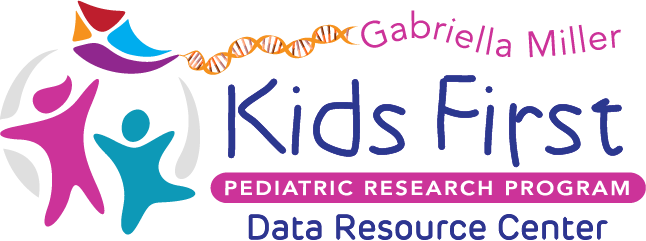

 [Home](https://github.com/NIH-NCPI)/[Resources](README.md)/Training

<h1> Training </h1>

<h2> Participating Partner Systems Training Resources </h2>

<h3> 
     <a href="https://anvilproject.org/"> NHGRI AnVIL - </a> 
     
     
          
     
     </h3>

This is an extensive collection of training resources covering major AnVIL components including [Terra](https://terra.bio/), [Gen3](https://gen3.org/), and [Dockstore](https://dockstore.org/). It includes information about setting up and managing accounts, accessing data, running analysis workflows, and performing interactive analyses.

| Training Resources | User Support | 
| --------------------- | ----------------------------- | 
| - [Learn About AnVIL](https://anvilproject.org/learn)   - [Video tutorials](https://anvilproject.org/learn/watch-videos-and-tutorials/anvil-videos) | - [Help Desk](https://anvilproject.org/help)    | 
 
---

<h3> 
     <a href="https://biodatacatalyst.nhlbi.nih.gov//"> NHLBI BioData Catalyst - </a> 
      
     
</h3>

 
This is BDC's documentation on data access, exploration, and analysis, as well as information about the platforms and services it leverages to offer tools, applications, and workflows in secure workspaces.   

| Training Resources | User Support | 
| --------------------- | ----------------------------- | 
| - [Documentation](https://bdcatalyst.gitbook.io)   - [Learning resources](https://biodatacatalyst.nhlbi.nih.gov/resources/learn)   - [Video resources](https://www.youtube.com/@nhlbibiodatacatalyst8024/videos) | - [Support forum/knowledgebase](https://bdcatalyst.freshdesk.com/)   - [Help Desk](https://biodatacatalyst.nhlbi.nih.gov/contact)   - [User FAQs](https://bdcatalyst.freshdesk.com/support/solutions/folders/60000230495) | 

---

<h3> 
     <a href="https://datacommons.cancer.gov/"> NCI CRDC - </a> 
          
     </h3>

This is a comprehensive collection of CRDC training resources developed by SevenBridges targeting users with different skill sets.

| Training Resources    | User Support   | 
| --------------------- | -------------- | 
| - [Documentation - Support for Researchers](https://datacommons.cancer.gov/support-researchers)   - [Tutorials and Guides - Support for CRDC Data Commons](https://datacommons.cancer.gov/support-crdc-data-commons)   - [Apps gallery](https://datacommons.cancer.gov/support-crdc-cloud-resources)   - [Webinars and Presentations](https://datacommons.cancer.gov/webinars-and-presentations) | - [Email support](mailto:NCICRDC@mail.nih.gov)       | 

---

<h3> 
     <a href="https://kidsfirstdrc.org/"> Kids First Data Resource Center - </a> 
      
     
     
</h3>

The Kids First DRC supports the [Kids First Data Resource Portal](https://portal.kidsfirstdrc.org/) for building virtual cohorts and identifying data files. The Portal is integrated with [CAVATICA](https://cavatica.sbgenomics.com/), a cloud-based storage, sharing, and analysis platform developed by Seven Bridges.

 

 

| Training Resources | User Support | 
| --------------------- | ----------------------------- | 
| - [Kids First Help Center](https://d3b.notion.site/Kids-First-DRC-Help-Center-c26b36ff66564417834f3f264475d10a)   - [Cavatica Support Documentation](https://docs.cavatica.org/)   - [Recorded Webinars and Demonstrations](https://www.youtube.com/channel/UCK9sPu0j4_ci4m3nNFa6gVw/featured) | - [Email support](mailto:support@kidsfirstdrc.org)   - [Monthly office hours](https://d3b.notion.site/Kids-First-Office-Hours-a77f6aa5889c4df4ae72302f92c51aa2) – 2nd Tuesday of each month   - [Kids First Forum](https://forum.kidsfirstdrc.org)   - [Frequently Asked Questions](https://kidsfirstdrc.org/faqs/) | 

---

<h2> Tutorials & Demos </h2>

<h3> NCPI Cross Platform Data Access Demo (July 27, 2021) </h3>

A demonstration of accessing datasets from four NCPI platforms in a single computational workspace.  
[Watch on YouTube](https://www.youtube.com/watch?v=YGZTxDdaWqk)

---

<h2> Interoperability and Cloud Computing Resources </h2>

| Training                                                                                                                                      | Cost                               | Note                                                 |
|-----------------------------------------------------------------------------------------------------------------------------------------------|------------------------------------|------------------------------------------------------|
| [dbGaP FHIR API Docs](https://github.com/ncbi/DbGaP-FHIR-API-Docs)                                                                            | Free                               | dbGaP FHIR training materials                        |
| [Get Started with GA4GH APIs](https://github.com/ga4gh/Get-Started-with-GA4GH-APIs/tree/main/sessions)                                         | Free                               | Tutorial using NCBI DRS and CRDC for compute         |
| [AWS Skill Builder](https://explore.skillbuilder.aws/learn)                                                                                   | Mix of free and subscription       |                                                      |
| [Microsoft Azure Resources for Academic Research](https://sway.office.com/bvawnEskQODqIONq)                                                   | Free                               |                                                      |
| [Grow Skills with Google Cloud Training](https://cloud.google.com/learn/training?hl=en)                                                       | Most cost, some free               |                                                      |
| [Cancer Data Science Course – Chapter 1: It's Never Too Early to Learn](https://datascience.cancer.gov/training/improve-data-science-skills/video-course/chapter/data-science-myths) | Free                               | Beginner series roadmap                              |

---

<h2> Previously Held Trainings </h2>

<h3> Train Your Colleague – Virtual Session (March 17–18, 2020) </h3>

The goal of this training session was to provide background information on the AnVIL, BioData Catalyst, Cancer Research Data Commons, and Kids First Platforms involved in the NIH Cloud Platforms Interoperability (NCPI) group to trainers and developers of these platforms.

<h4> Day 1 – Component introduction </h4> 

| Session                                               | Materials                                                                                                                   |
|-------------------------------------------------------|-----------------------------------------------------------------------------------------------------------------------------|
| Stack (IC) introductions                              | [Slides](Training_Slides/Stack%20introductions.pdf), [Video](https://youtu.be/PspTGZIbw5I) |
| Systems Interoperations WG update                     | [Slides](Training_Slides/Systems-Interoperations-WG-Update.pdf), [Video](https://youtu.be/-3bqz4B67QE) |
| Gen3 introduction                                     | [Video](https://youtu.be/tzqCYwQRgfU)                                                                                       |
| Terra introduction                                    | [Slides Part 1](Training_Slides/Terra-Architecture-and-Design.pdf), [Slides Part 2](Training_Slides/Terra-Introduction.pdf), [Video](https://youtu.be/eQwHTQKPCeA)                |
| Dockstore introduction                                | [Slides](Training_Slides/Dockstore-Introduction.pdf), [Video](https://youtu.be/fgrwJ1VN91s)            |
| PIC-SURE introduction                                 | [Slides](Training_Slides/PIC-SURE-Introduction.pdf), [Video](https://youtu.be/jOdIlEybj4A)        |
| Seven Bridges introduction                            | [Video](https://youtu.be/1wHenZ0QR08)                                                                                       |
| ISB-CGC introduction                                  | [Slides](Training_Slides/ISB-CGC-Components.pdf), [Video](https://youtu.be/JDqm7NsG46Y)                                       |

<h4> Day 2 – Use cases </h4>

| Session                                                                                                 | Materials                                           |
|---------------------------------------------------------------------------------------------------------|-----------------------------------------------------|
| AnVIL/BioData Catalyst gold standard use case                                                          | [Video](https://youtu.be/uyrgVvhplwM)               |
| Seven Bridges use case                                                                                  | [Video](https://youtu.be/elmG_02zn_4)               |
| Kids First DRC & BioData Catalyst use case                                                             | [Video](https://youtu.be/w3m3EvK3pKw)               |
| Institute of Systems Biology – Cancer Genomics Cloud / CRDC use case                                    | [Video](https://youtu.be/kLgHSW-39XE)               |

---
